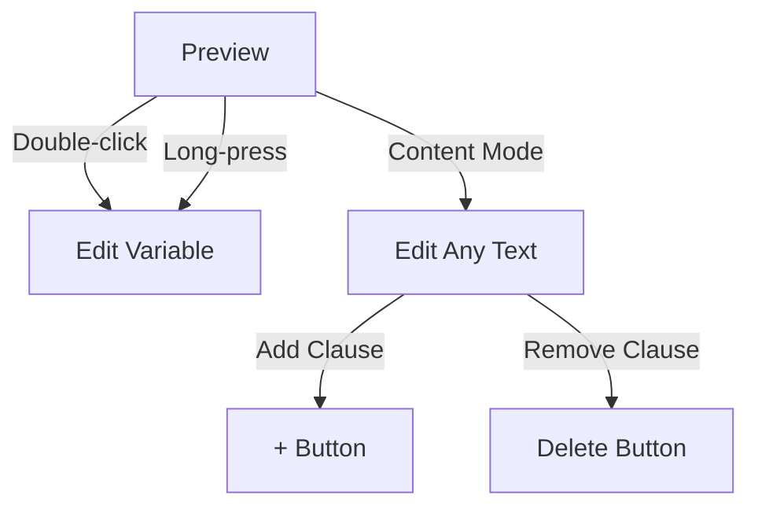

# Contract-Generator  

**Purpose**: A web app for creating and editing legal templates with perfect Turkish character support in PDF exports.

## ✨ Features
- [x] Dual-mode editing (variables & full content)
- [x] Clause management (add/remove paragraphs)
- [x] Real-time preview with validation
- [x] Multi-page PDF generation with Turkish characters
- [ ] User authentication
- [ ] Version history

## 🛠 Technical Stack
### Frontend
- Vite + React (JavaScript)
- PDF Generation: pdf-lib + fontkit
- State Management: React Context
- Routing: react-router-dom@7

### Styling & Interaction
- CSS Modules with responsive design
- Touch & mouse support
- In-place editing (double-click/long press)

## 🚀 Getting Started

1. **Prerequisites**
```bash
# Font installation
mkdir -p public/fonts && curl -o public/fonts/NotoSans-Regular.ttf https://fonts.gstatic.com/s/notosans/v15/o-0IIpQlx3QUlC5A4PNr5TRF.ttf
```
2. **Development**
```bash
npm install
npm run dev
```
## 🎯 Interaction Guide


## Key Shortcuts:

- Enter: Save edits
- Escape: Cancel edit
- Ctrl+Z: Undo (coming soon)    

## Important Notes:
**Template Structure**
```json
{
  "title": "Kira Sözleşmesi",
  "content": "Kiracı: {{kiracı}}\n\n**MADDELER**:\n1. {{madde1}}",
  "variables": {
    "kiracı": { "type": "text", "required": true }
  }
}
```

## Known Issues
1. Content persistence requires backend integration
2. Mobile touch gestures may need refinement
3. Canceling edits doesn't restore previous state

## 🔧 Testing
```javascript

// Test clause management
test('Adds new contract clauses', () => {
  render(<ContractEditor />);
  userEvent.click(screen.getByText('+ Add Clause'));
  expect(screen.getByText('NEW CLAUSE')).toBeInTheDocument();
});
```
## Roadmap
- MongoDB integration for templates
- Undo/redo functionality
- Collaborative editing
- Template marketplace