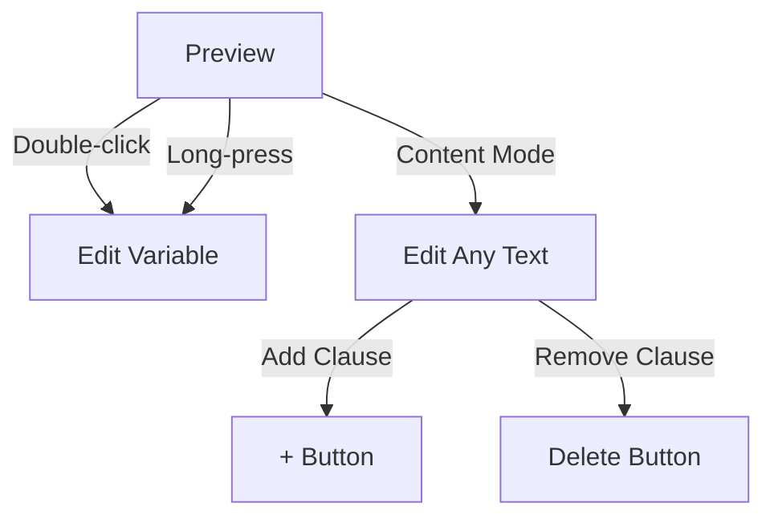

# Contract-Generator

**Purpose**: A web app for creating and editing legal templates with perfect Turkish character support in PDF exports.

## ✨ Core Features
### Editing Capabilities
- [x] Dual-mode editing (variables & full content)
- [x] Clause management (add/remove paragraphs)
- [ ] Real-time preview with validation
### PDF Generation
- [x] Multi-page PDF generation with Turkish characters

## 🎯 User Interaction
### Editor Modes

## 🛠 Technical Stack
### Frontend Stack
- Vite + React (JavaScript)
- PDF Generation: pdf-lib + fontkit
- State Management: React Context
- Routing: react-router-dom@7
### Backend Stack
- MongoDB

### Styling & Interaction
- CSS Modules with responsive design
- Touch & mouse support
- In-place editing (double-click/long press)

