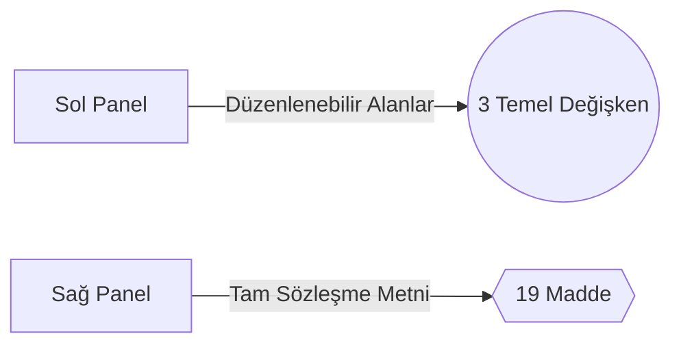

## Proje Adı: Contract-Generator
## Amaç
Kullanıcıların şablon sözleşmeleri düzenleyip Türkçe karakter desteğiyle PDF olarak indirebileceği stabil bir web uygulaması.

## 🔧 Teknik Detaylar
- Frontend: React (JavaScript) + Vite
- PDF Kütüphanesi: pdf-lib + fontkit (Türkçe karakter desteğiyle)
- Routing: react-router-dom v7
- Styling: CSS Modules + Grid Layout
- Mobil Duyarlılık: Evet (Temel responsive desteği)

## ✅ Son Yapılan Değişiklikler

1. PDF Generator Yenilendi
- @react-pdf/renderer kaldırıldı
- Yeni implementasyon: pdf-lib + fontkit
- Türkçe karakter sorunu tamamen çözüldü (ğ, ş, ı, İ vb.)
- Font: Noto Sans (public/fonts altında)
- Akıllı değişken yönetimi (peşinat, depozito, kontrat süresi)
- Gerçekçi mock data yapısı

2. **Yeni Arayüz**

3. **PDF Optimizasyonları**

- Otomatik sayfa ekleme
- Türkçe font embedding (Noto Sans)
- Profesyonel doküman formatı

## 📝 İstenen Sonraki Adımlar
1. Dinamik Alan Desteği:

- [ŞİRKET_ADI] gibi placeholder'ları otomatik algılayan form
- Kullanıcıya bu alanları doldurması için inputlar gösterme

2. Backend Entegrasyonu:
```
mermaid
graph LR
A[Frontend] -->|Axios| B[Node.js/Express]
B --> C[MongoDB]
```
3. Yeni Özellikler:

- PDF imza alanı ekleme
- Şablon kategorizasyonu
- Kullanıcı özel şablon kaydetme

## 📂 Şablon Yapısı
{
  "id": 3,
  "title": "Kira Sözleşmesi",
  "content": "10. Peşinat: {{peşinat_miktar}} TL\n12. Süre: {{kontrat_yıl}} yıl...",
  "variables": {
    "peşinat_miktar": "5000",
    "kontrat_yıl": "3"
  }
}

