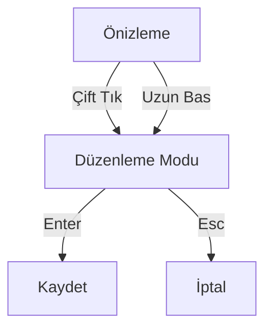

## Proje Adı: Contract-Generator
## Amaç
Kullanıcıların şablon sözleşmeleri düzenleyip Türkçe karakter desteğiyle PDF olarak indirebileceği stabil bir web uygulaması.

## 🔧 Teknik Detaylar
- Frontend: React (JavaScript) + Vite
- PDF Kütüphanesi: pdf-lib + fontkit (Türkçe karakter desteğiyle)
- Routing: react-router-dom v7
- Styling: CSS Modules
- Etkileşim: Çift tık/uzun basma desteği
- Mobil Duyarlılık: Tam touch desteği

## ✅ Son Yapılan Değişiklikler
1. **Yeni Editör Yaklaşımı**


2. **PDF Generator Yenilendi**
- @react-pdf/renderer kaldırıldı
- Yeni implementasyon: pdf-lib + fontkit
- Türkçe karakter sorunu tamamen çözüldü (ğ, ş, ı, İ vb.)
- Font: Noto Sans (public/fonts altında)
- Akıllı satır kaydırma ve sayfa sonu yönetimi

3. **Arayüz Yenilikleri**
- Sol panel kaldırıldı (doğrudan metin üzerinde düzenleme)
- Boş alanlar sarı vurgulu
- Zorunlu alan validasyonu (kırmızı çerçeve + uyarı)
- Mobil optimizasyon (klavye açılınca otomatik kaydırma)

## 📝 İstenen Sonraki Adımlar
1. **Gelişmiş Editör Özellikleri**

- Rich text düzenleme (kalın/italik)
- Madde numaralarını otomatik artırma
- Şablon bölümlerini foldable yapma

2. Backend Entegrasyonu:
```
graph LR
A[Frontend] -->|REST API| B[Node.js/Express]
B --> C[(PostgreSQL)]
C --> D[Şablon Yönetimi]
```
3. Yeni Özellikler:

- PDF imza alanı ekleme
- Dinamik tablo oluşturma
- Versiyon kontrolü (şablon geçmişi)

## 📂 Güncel Şablon Yapısı
{
  "id": 3,
  "title": "Kira Sözleşmesi",
  "category": "Gayrimenkul",
  "content": "Kiracı: {{kiracı}}\nPeşinat: {{peşinat_miktar}} TL...",
  "variables": {
    "kiracı": "",
    "peşinat_miktar": "",
    "kontrat_yıl": "1"
  }
}


## Key changes made:
1. Removed references to the left panel in both documents
2. Added documentation for the new in-place editing system
3. Updated interaction guides
4. Added new technical details about touch/long-press support
5. Updated the visual diagrams to reflect the current architecture
6. Added installation instructions for the required font
7. Kept all Turkish character support information
8. Updated test examples to reflect the new editing method
