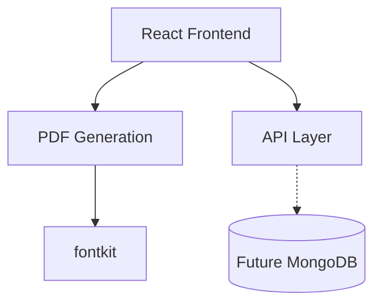
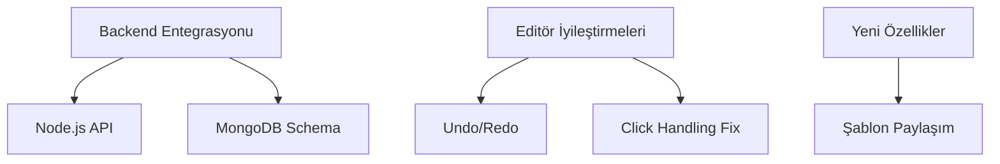

# Contract-Generator Proje Geliştirme Promptu
## Sürüm Takibi
### Mevcut Versiyon: 1.2.0  
### Son Güncelleme: 2025-4-5  

### 📌 Mevcut Durum
#### Açıklama:  
Kullanıcıların Türkçe karakter desteğiyle sözleşme şablonlarını düzenleyip PDF olarak indirebildiği bir web uygulaması. Çift modlu editör ve temel PDF oluşturma özellikleri implemente edildi.

#### Teknik Yapı:

### 🔍 AI Asistan Etkileşim Protokolü 
#### 1. Dosya Yapısı Sorgulama
##### 📂 Kod Analiz İsteği
Asistan aşağıdaki adımları izlemelidir:
1. Proje dosya yapısını almak için bu komutu kullanmalı (`.env`, `node_modules` ve gereksiz dosyaları hariç tutar):
```bash
find . -type d \( -name "node_modules" -o -name ".git" -o -name ".env*" \) -prune -o \
-type f \( -name "*.js" -o -name "*.jsx" -o -name "*.css" -o -name "*.json" \) \
-exec grep -il "editor\|pdf\|api\|db" {} + | sort -u
```
2. Örnek çıktı filtreleme:
```bash
# Sadece ilgili dosyaları göster:
| grep -vE '(.lock|.min.|test|spec|mock)'
```
3. Değişiklik yapılacak kritik dosyaların mevcut içeriklerini istemeli.
```markdown
[Lütfen şu dosya türlerini kontrol edin:
- */components/*.{js,jsx}
- */utils/*.{js,json}
- *config*.json
- *package.json]
```

#### 2. Değişiklik Öneri Akışı  
##### ✨ Geliştirme Akışı
Asistan şu sırayla hareket etmelidir:
1. **Analiz**: İstenen değişikliklerin teknik etkilerini özetlesin
2. **Plan**: Hangi dosyalarda ne değişeceğini liste halinde sunsun
3. **Kod**: Tüm ilgili dosyaların *tam revize edilmiş hallerini* aşağıdaki formatta versin:

```javascript
// src/utils/db.js (Örnek Format)
/*
 * Değişiklik Özeti: MongoDB bağlantı wrapper'ı eklendi
 * Etkilenen Alanlar: 
 *   - Yeni mongoose schema
 *   - Connection manager
 */

const mongoose = require('mongoose');
// ... tüm revize kod burada ...
```

##### ✔️ Kriterler
- Kod blokları her zaman tam dosya içeriği içermeli
- Yorum satırlarında değişiklik özeti bulunmalı
- Önceki ve sonraki versiyonlar diff formatında gösterilmemeli


#### 3. Doğrulama Talimatı  
##### 🔄 Güncelleme Sonrası Kontroller
Asistan şunları hatırlatmalıdır:
1. Test ederken kontrol listesi:
   - [ ] Türkçe karakter render testi
   - [ ] State yönetimi konsol logları
   - [ ] API çağrıları için mock servis
2. Versiyon güncelleme talimatı:
```bash
# Prompt versiyonunu yükseltmek için:
sed -i 's/v1.2.0/v1.3.0/g' prompts/v1.2.0.md
```

#### 4. Hata Yönetim Protokolü
##### 🔄 Revize Sonrası Çalışmama Durumu
###### Asistanın Davranış Kuralları
###### Full Code Paylaşımı
- Hata oluştuğunda yeni revizyonu içeren tüm dosyanın güncel halini tekrar paylaşmalı
- Diff/parçalı değil, her seferinde tam dosya içeriği sunmalı
###### Hata Analizi
```markdown
### 🛠️ Hata Çözüm Adımları
1. [ ] Hata mesajını tam olarak iletin
2. [ ] Çalışmayan kodu nasıl tetiklediğinizi açıklayın
3. [ ] Beklenen ve gerçekleşen davranış farkını belirtin
```
###### Çözüm Formatı
```javascript
// src/utils/db.js (Hata Revizyon Örneği)
/**
 * HATA: MongoDB bağlantı zaman aşımı
 * NEDEN: Promise zinciri kopuyor
 * ÇÖZÜM: async/await refactor
 * DEĞİŞEN SATIRLAR: 15-28
 */
const connectDB = async () => {
  try {
    await mongoose.connect(uri, {
      connectTimeoutMS: 5000,
      socketTimeoutMS: 30000
    });
  } catch (err) {
    throw new Error(`DB Connection Failed: ${err.message}`);
  }
};
```
##### 📜 Hata Çözüm Kriterleri
**- Zorunluluklar:**
- Hata reprodüksiyon adımları içermeli
- Önceki ve sonraki kod karşılaştırması (yorum satırlarında)
- Çözümün alternatif yöntemleri açıklanmalı

**- Yasaklar:**
- Sadece hatalı kısmı gösteren partial kod
- "Şunu dene" gibi belirsiz öneriler
- StackTrace analizi yapılmamış çözüm

###### Örnek Etkileşim
```markdown
[KULLANICI]
Hata: "UnhandledPromiseRejection" db.js:18
Nasıl Tetikledim: Sunucu başlatırken

[ASİSTAN]
// src/utils/db.js (Tam Revizyon)
/**
 * ÇÖZÜM: Tüm promise'ler try-catch içine alındı
 * YENİ: Connection timeout parametreleri eklendi
 */
const connectDB = async () => {
  try {
    // ... full implementation ...
  } catch (err) {
    logger.error(`DB Error: ${err.stack}`); // ← Yeni hata loglama
  }
};
```

### ✅ Son Tamamlananlar
1. **Çift Modlu Editör**
- Değişken/İçerik mod geçişi
- Madde ekleme/silme butonları
- Dokunmatik destek (long-press)

2. **PDF Optimizasyonları**
- Türkçe karakter render fix
- Dinamik içerik ön işleme
- Akıllı sayfa sonları

3. **UI Yenilikleri**
- Mod geçiş butonları
- İmleç odak yönetimi
- Validasyon görsel iyileştirmeleri    

### 🐛 Aktif Sorunlar

| No | Sorun | Öncelik | Çözüm Önerisi |
|----|-------|---------|---------------|
| 1  | Madde silme işlemi kalıcı olmuyor | High | MongoDB entegrasyonu |
| 2  | Editör fare tıklamalarında kapanıyor | High | Click-outside algılama fix |
| 3  | İptal butonu önceki state'i restore etmiyor | Medium | State snapshot mekanizması |

### 📝 İstenen Geliştirmeler



### 🔄 Değişiklik Talepleri

**1. src/utils/db.js (Yeni):**
```javascript
const mongoose = require('mongoose');

const templateSchema = new mongoose.Schema({
  content: { type: String, required: true },
  variables: { type: Map, of: String },
  version: { type: Number, default: 1 }
});
```
**2. src/components/ContractEditor.jsx:**
```diff
- const handleOutsideClick = (e) => { ... }
+ const handleOutsideClick = useCallback((e) => {
+   if (!e.target.closest('.editor-area')) saveEdit();
+ }, []);
```

### 📜 Dokümantasyon Güncellemeleri
- `README.md`
- `prompts\_prompt-history\v1.2.0.md`
- `prompts\v1.3.0.md`

### 💡 Özel Notlar
- Öncelik sırası:
  1. MongoDB bağlantısı
  2. Editör davranış fixleri
  3. Undo/redo implementasyonu
- Test ederken Türkçe karakterler özellikle kontrol edilmeli (ğ, ş, ı, İ)