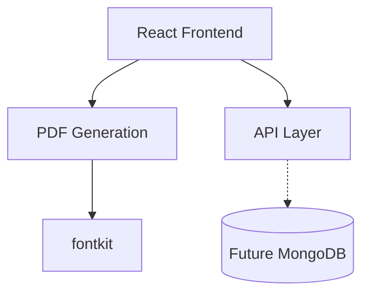
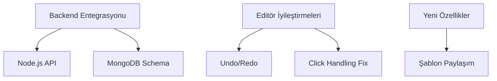

# Contract-Generator Proje Geliştirme Promptu
## Versiyon: 1.3.0  
## Son Güncelleme: 2023-12-15  

### 📌 Mevcut Durum
**Açıklama**:  
Kullanıcıların Türkçe karakter desteğiyle sözleşme şablonlarını düzenleyip PDF olarak indirebildiği bir web uygulaması. Çift modlu editör ve temel PDF oluşturma özellikleri implemente edildi.

**Teknik Yapı**:


### ✅ **Son Tamamlananlar**
1. **Çift Modlu Editör**
- Değişken/İçerik mod geçişi
- Madde ekleme/silme butonları
- Dokunmatik destek (long-press)

2. **PDF Optimizasyonları**
- Türkçe karakter render fix
- Dinamik içerik ön işleme
- Akıllı sayfa sonları

3. **UI Yenilikleri**
- Mod geçiş butonları
- İmleç odak yönetimi
- Validasyon görsel iyileştirmeleri    

### 🐛 **Aktif Sorunlar**

| No | Sorun | Öncelik | Çözüm Önerisi |
|----|-------|---------|---------------|
| 1  | Madde silme işlemi kalıcı olmuyor | High | MongoDB entegrasyonu |
| 2  | Editör fare tıklamalarında kapanıyor | High | Click-outside algılama fix |
| 3  | İptal butonu önceki state'i restore etmiyor | Medium | State snapshot mekanizması |

### 📝 **İstenen Geliştirmeler**



### 🔄 **Değişiklik Talepleri**

**1. src/utils/db.js (Yeni):**
```javascript
const mongoose = require('mongoose');

const templateSchema = new mongoose.Schema({
  content: { type: String, required: true },
  variables: { type: Map, of: String },
  version: { type: Number, default: 1 }
});
```
**2. src/components/ContractEditor.jsx:**
- const handleOutsideClick = (e) => { ... }
+ const handleOutsideClick = useCallback((e) => {
+   if (!e.target.closest('.editor-area')) saveEdit();
+ }, []);

### 📜 **Dokümantasyon Güncellemeleri**
- `README.md`
- `API_DOCS.md` (Backend sonrası)
- `ARCHITECTURE.md`

### 💡 **Özel Notlar**
- Öncelik sırası:
  1. MongoDB bağlantısı
  2. Editör davranış fixleri
  3. Undo/redo implementasyonu
- Test ederken Türkçe karakterler özellikle kontrol edilmeli (ğ, ş, ı, İ)

**Dosya Kullanım Talimatları**:

1. Bu dosyayı projenizin kök dizininde `/prompts` klasörüne kaydedin:
   ```bash
   mkdir -p prompts
   touch prompts/contract_generator_prompt_v1.3.0.md
    ```

2. Versiyonlama için semantik versiyonlama (SemVer) kullanın:

MAJOR: Büyük mimari değişiklikler
MINOR: Yeni özellikler
PATCH: Bug fixleri

3. Yeni asistana iletilirken:
```markdown
Lütfen aşağıdaki prompt dosyasını inceleyerek projeye katkı sağlayın:
[Dosya içeriğini buraya yapıştır]
```

4. Güncelleme yaparken
# Önceki versiyonu arşivle
mv prompts/contract_generator_prompt_v1.3.0.md prompts/archive/

# Yeni versiyonu oluştur
touch prompts/contract_generator_prompt_v1.4.0.md

## Dosya Yapısı Örneği
my-project/
├── prompts/
│   ├── contract_generator_prompt_v1.3.0.md
│   └── archive/
│       ├── v1.2.0.md
│       └── v1.1.0.md
└── src/
    └── ... # Proje dosyaları


