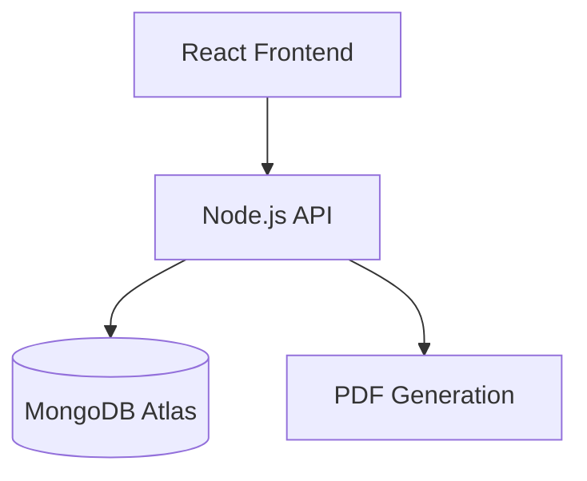

# Contract-Generator Proje Geliştirme Promptu
## Sürüm Takibi
### Mevcut Versiyon: 1.4.0  
### Son Güncelleme: 2025-4-5  

### 📌 Mevcut Durum
#### Açıklama:  
Kullanıcıların Türkçe karakter desteğiyle sözleşme şablonlarını düzenleyip PDF olarak indirebildiği bir web uygulaması. Backend entegrasyonu tamamlandı, artık veriler MongoDB'de saklanıyor.

#### Teknik Yapı:

### 🔍 AI Asistan Etkileşim Protokolü 
Asistan şu sırayla hareket etmelidir:
1. **Plan**: Dosya yapısını ve ilgili olabilecek tüm dosyaların içeriklerini istesin
2. **Analiz**: İstenen değişikliklerin teknik etkilerini özetlesin
2. **Plan**: Hangi dosyalarda ne değişeceğini liste halinde sunsun
3. **Kod**: Tüm ilgili dosyaların *tam revize edilmiş hallerini* versin. Revize kodun en üzerine revize özetini yorum olarak eklesin.

##### ✔️ Kriterler
- Kod blokları her zaman tam dosya içeriği içermeli
- Yorum satırlarında değişiklik özeti bulunmalı
- Önceki ve sonraki versiyonlar diff formatında gösterilmemeli


#### Hata Yönetim Protokolü
- Hata oluştuğunda yeni revizyonu içeren tüm dosyanın güncel halini tekrar paylaşmalı
- Diff/parçalı değil, her seferinde tam dosya içeriği sunmalı

##### 📜 Hata Çözüm Kriterleri
**- Zorunluluklar:**
- Hata reprodüksiyon adımları içermeli
- Önceki ve sonraki kod karşılaştırması (yorum satırlarında)
- Çözümün alternatif yöntemleri açıklanmalı

**- Yasaklar:**
- Sadece hatalı kısmı gösteren partial kod
- "Şunu dene" gibi belirsiz öneriler
- StackTrace analizi yapılmamış çözüm

###### Örnek Etkileşim
```markdown
[KULLANICI]
Hata: "UnhandledPromiseRejection" db.js:18
Nasıl Tetikledim: Sunucu başlatırken

[ASİSTAN]
// src/utils/db.js (Tam Revizyon)
/**
 * ÇÖZÜM: Tüm promise'ler try-catch içine alındı
 * YENİ: Connection timeout parametreleri eklendi
 */
const connectDB = async () => {
  try {
    // ... full implementation ...
  } catch (err) {
    logger.error(`DB Error: ${err.stack}`); // ← Yeni hata loglama
  }
};
```

### ✅ Son Tamamlananlar
1. **Backend Entegrasyonu**
- server/ klasör yapısı oluşturuldu
- MongoDB bağlantısı (mongoose)
- Temel CRUD API endpoint'leri
- Postman/curl test senaryoları

2. **Dosya Yapısı**
```
server/
├── models/
│   └── Contract.js           # MongoDB şema tanımı
├── routes/
│   └── contracts.js          # API rotaları
├── server.js                 # Express sunucusu
└── .env                      # DB bağlantı bilgileri`
```

### 🐛 Aktif Sorunlar

| No | Sorun | Öncelik | Çözüm Önerisi |
|----|-------|---------|---------------|
| 1  | Madde silme işlemi kalıcı olmuyor | High | MongoDB entegrasyonunun tamamlanması |
| 2  | Editör fare tıklamalarında kapanıyor | High | Click-outside algılama fix |
| 3  | İptal butonu önceki state'i restore etmiyor | Medium | State snapshot mekanizması |

### 📝 İstenen Geliştirmeler & 🔄 Değişiklik Talepleri

**1. server/routes/contracts.js (Eklenecek):**
```javascript
/*
 * Değişiklik Özeti: DELETE endpoint eklenecek
 * Etkilenen Alanlar:
 *   - Sözleşme silme işlemi
 */
router.delete('/:id', async (req, res) => {
  try {
    await Contract.findByIdAndDelete(req.params.id);
    res.sendStatus(204);
  } catch (err) {
    res.status(500).json({ message: err.message });
  }
});

```
**2. client/src/utils/api.js (Güncellenecek):**
```javascript
/*
 * Değişiklik Özeti: CRUD fonksiyonları tamamlanacak
 */
export const deleteContract = async (id) => {
  await fetch(`/api/contracts/${id}`, { method: 'DELETE' });
};
```
